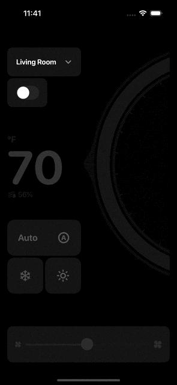

  
# ThermostatControlSwiftUI
  

These UI components for a thermostat app allow you to manage home air conditioning systems and climate control.

The pack features a single-screen interface with multiple options, allowing you to change climate control modes and set temperatures in different rooms. This customization ensures optimal comfort and energy efficiency at home.

The smooth gradients illustrate temperature transitions, highlighting the functionality and enhancing the user experience. We also spiced up the UI components with a sleek, enigmatic animation that showcases smooth color changes and intuitive controls for managing climate settings. It guides users through the various functions, making your future app visually appealing and easy to navigate.

  
## Give it a try and reach us

Explore our expertise in <a href="https://shakuro.com/services/native-mobile-development/?utm_source=github&utm_medium=repository&utm_campaign=thermostat">Native Mobile Development</a> and <a href="https://shakuro.com/services/ios-dev/?utm_source=github&utm_medium=repository&utm_campaign=thermostat">iOS Development</a>.

If you need professional assistance with your mobile or web project, feel free to <a href="https://shakuro.com/get-in-touch/?utm_source=github&utm_medium=repository&utm_campaign=thermostat">contact our team</a>
